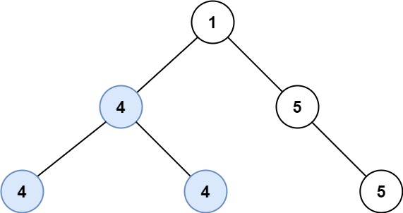

## 687. Longest Univalue Path

Given the ```root``` of a binary tree, return *the length of the longest path, where each node in the path has the same value*. This path may or may not pass through the root.

**The length of the path** between two nodes is represented by the number of edges between them.

##### Example 1:


```
Input: root = [5,4,5,1,1,5]
Output: 2
```
##### Example 2:



```
Input: root = [1,4,5,4,4,5]
Output: 2
```

##### Constraints:

* The number of nodes in the tree is in the range ```[0, 10^4]```.
* ```-1000 <= Node.val <= 1000```
* The depth of the tree will not exceed ```1000```.