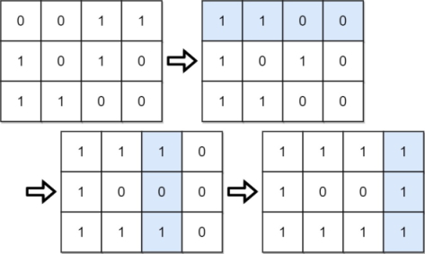

## 861. Score After Flipping Matrix

You are given an ```m x n``` binary matrix ```grid```.

A **move** consists of choosing any row or column and toggling each value in that row or column (i.e., changing all ```0```'s to ```1```'s, and all ```1```'s to ```0```'s).

Every row of the matrix is interpreted as a binary number, and the **score** of the matrix is the sum of these numbers.

Return *the highest possible **score** after making any number of **moves** (including zero moves)*.

### Example 1:



```
Input: grid = [[0,0,1,1],[1,0,1,0],[1,1,0,0]]
Output: 39
Explanation: 0b1111 + 0b1001 + 0b1111 = 15 + 9 + 15 = 39
```
### Example 2:
```
Input: grid = [[0]]
Output: 1
```

### Constraints:

* ```m == grid.length```
* ```n == grid[i].length```
* ```1 <= m, n <= 20```
* ```grid[i][j]``` is either ```0``` or ```1```.