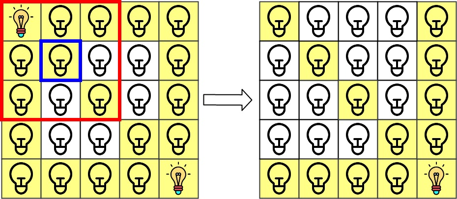

## 1001. Grid Illumination

There is a 2D ```grid``` of size ```n x n``` where each cell of this grid has a lamp that is initially **turned off**.

You are given a 2D array of lamp positions ```lamps```, where ```lamps[i] = [rowi, coli]``` indicates that the lamp at ```grid[rowi][coli]``` is **turned on**. Even if the same lamp is listed more than once, it is turned on.

When a lamp is turned on, it **illuminates its cell** and **all other cells** in the same **row, column, or diagonal**.

You are also given another 2D array ```queries```, where ```queries[j] = [rowj, colj]```. For the ```j```-th query, determine whether ```grid[rowj][colj]``` is illuminated or not. After answering the ```j```-th query, **turn off** the lamp at ```grid[rowj][colj]``` and its **8 adjacent lamps** if they exist. A lamp is adjacent if its cell shares either a side or corner with ```grid[rowj][colj]```.

Return *an array of integers* ```ans```, *where* ```ans[j]``` *should be* ```1``` *if the cell in the* ```j```-th *query was illuminated, or* ```0``` *if the lamp was not*.

##### Example 1:


```
Input: n = 5, lamps = [[0,0],[4,4]], queries = [[1,1],[1,0]]
Output: [1,0]
Explanation: We have the initial grid with all lamps turned off. In the above picture we see the grid after turning on the lamp at grid[0][0] then turning on the lamp at grid[4][4].
The 0th query asks if the lamp at grid[1][1] is illuminated or not (the blue square). It is illuminated, so set ans[0] = 1. Then, we turn off all lamps in the red square.
```



```
The 1st query asks if the lamp at grid[1][0] is illuminated or not (the blue square). It is not illuminated, so set ans[1] = 0. Then, we turn off all lamps in the red rectangle.
```


##### Example 2:
```
Input: n = 5, lamps = [[0,0],[4,4]], queries = [[1,1],[1,1]]
Output: [1,1]
```
##### Example 3:
```
Input: n = 5, lamps = [[0,0],[0,4]], queries = [[0,4],[0,1],[1,4]]
Output: [1,1,0]
```

##### Constraints:

* ```1 <= n <= 10^9```
* ```0 <= lamps.length <= 20000```
* ```0 <= queries.length <= 20000```
* ```lamps[i].length == 2```
* ```0 <= rowi, coli < n```
* ```queries[j].length == 2```
* ```0 <= rowj, colj < n```