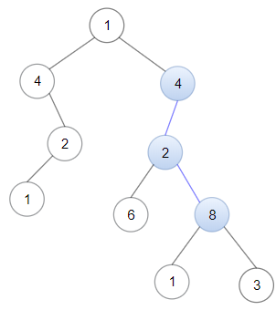

## 1367. Linked List in Binary Tree

Given a binary tree ```root``` and a linked list with ```head``` as the first node.

Return True if all the elements in the linked list starting from the ```head``` correspond to some *downward path* connected in the binary tree otherwise return False.

In this context downward path means a path that starts at some node and goes downwards.

##### Example 1:



```
Input: head = [4,2,8], root = [1,4,4,null,2,2,null,1,null,6,8,null,null,null,null,1,3]
Output: true
Explanation: Nodes in blue form a subpath in the binary Tree.
```
##### Example 2:


```
Input: head = [1,4,2,6], root = [1,4,4,null,2,2,null,1,null,6,8,null,null,null,null,1,3]
Output: true
```
##### Example 3:
```
Input: head = [1,4,2,6,8], root = [1,4,4,null,2,2,null,1,null,6,8,null,null,null,null,1,3]
Output: false
Explanation: There is no path in the binary tree that contains all the elements of the linked list from head.
```

##### Constraints:

* The number of nodes in the tree will be in the range ```[1, 2500]```.
* The number of nodes in the list will be in the range ```[1, 100]```.
* ```1 <= Node.val <= 100``` for each node in the linked list and binary tree.