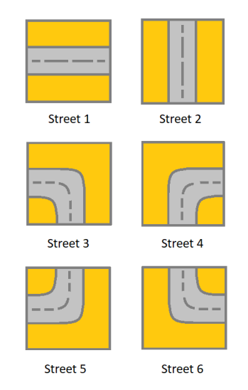
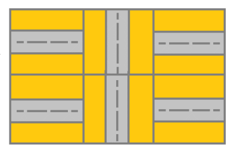

## 1391. Check if There is a Valid Path in a Grid

You are given an ```m x n``` ```grid```. Each cell of ```grid``` represents a street. The street of ```grid[i][j]``` can be:

* ```1``` which means a street connecting the left cell and the right cell.
* ```2``` which means a street connecting the upper cell and the lower cell.
* ```3``` which means a street connecting the left cell and the lower cell.
* ```4``` which means a street connecting the right cell and the lower cell.
* ```5``` which means a street connecting the left cell and the upper cell.
* ```6``` which means a street connecting the right cell and the upper cell.



You will initially start at the street of the upper-left cell ```(0, 0)```. A valid path in the grid is a path that starts from the upper left cell ```(0, 0)``` and ends at the bottom-right cell ```(m - 1, n - 1)```. **The path should only follow the streets**.

**Notice** that you are **not allowed** to change any street.

Return ```true``` *if there is a valid path in the grid or* ```false``` *otherwise*.

### Example 1:


```
Input: grid = [[2,4,3],[6,5,2]]
Output: true
Explanation: As shown you can start at cell (0, 0) and visit all the cells of the grid to reach (m - 1, n - 1).
```
### Example 2:



```
Input: grid = [[1,2,1],[1,2,1]]
Output: false
Explanation: As shown you the street at cell (0, 0) is not connected with any street of any other cell and you will get stuck at cell (0, 0)
```
### Example 3:
```
Input: grid = [[1,1,2]]
Output: false
Explanation: You will get stuck at cell (0, 1) and you cannot reach cell (0, 2).
```

### Constraints:

* ```m == grid.length```
* ```n == grid[i].length```
* ```1 <= m, n <= 300```
* ```1 <= grid[i][j] <= 6```