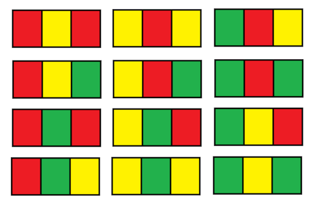

## 1411. Number of Ways to Paint N x 3 Grid

You have a ```grid``` of size ```n x 3``` and you want to paint each cell of the grid with exactly one of the three colors: **Red**, **Yellow**, or **Green** while making sure that no two adjacent cells have the same color (i.e., no two cells that share vertical or horizontal sides have the same color).

Given ```n``` the number of rows of the grid, return *the number of ways* you can paint this ```grid```. As the answer may grow large, the answer **must be** computed modulo ```10^9 + 7```.

### Example 1:



```
Input: n = 1
Output: 12
Explanation: There are 12 possible way to paint the grid as shown.
```
### Example 2:
```
Input: n = 5000
Output: 30228214
```

### Constraints:

* ```n == grid.length```
* ```1 <= n <= 5000```