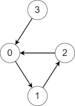

## 2876. Count Visited Nodes in a Directed Graph

There is a **directed** graph consisting of ```n``` nodes numbered from ```0``` to ```n - 1``` and ```n``` directed edges.

You are given a **0-indexed** array ```edges``` where ```edges[i]``` indicates that there is an edge from node ```i``` to node ```edges[i]```.

Consider the following process on the graph:

* You start from a node ```x``` and keep visiting other nodes through edges until you reach a node that you have already visited before on this **same** process.

Return *an array* ```answer``` *where* ```answer[i]``` *is the number of **different** nodes that you will visit if you perform the process starting from node* ```i```.

### Example 1:



```
Input: edges = [1,2,0,0]
Output: [3,3,3,4]
Explanation: We perform the process starting from each node in the following way:
- Starting from node 0, we visit the nodes 0 -> 1 -> 2 -> 0. The number of different nodes we visit is 3.
- Starting from node 1, we visit the nodes 1 -> 2 -> 0 -> 1. The number of different nodes we visit is 3.
- Starting from node 2, we visit the nodes 2 -> 0 -> 1 -> 2. The number of different nodes we visit is 3.
- Starting from node 3, we visit the nodes 3 -> 0 -> 1 -> 2 -> 0. The number of different nodes we visit is 4.
```
### Example 2:


```
Input: edges = [1,2,3,4,0]
Output: [5,5,5,5,5]
Explanation: Starting from any node we can visit every node in the graph in the process.
```

### Constraints:

* ```n == edges.length```
* ```2 <= n <= 10^5```
* ```0 <= edges[i] <= n - 1```
* ```edges[i] != i```