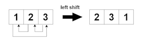
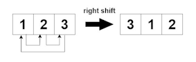

## 2946. Matrix Similarity After Cyclic Shifts

You are given an ```m x n``` integer matrix ```mat``` and an integer ```k```. The matrix rows are 0-indexed.

The following proccess happens ```k``` times:

* **Even-indexed** rows (0, 2, 4, ...) are cyclically shifted to the left.



* **Odd-indexed** rows (1, 3, 5, ...) are cyclically shifted to the right.



Return ```true``` if the final modified matrix after ```k``` steps is identical to the original matrix, and ```false``` otherwise.

### Example 1:
```
Input: mat = [[1,2,3],[4,5,6],[7,8,9]], k = 4
Output: false
```
### Example 2:
```
Input: mat = [[1,2,1,2],[5,5,5,5],[6,3,6,3]], k = 2
Output: true
```
### Example 3:
```
Input: mat = [[2,2],[2,2]], k = 3
Output: true
Explanation:
As all the values are equal in the matrix, even after performing cyclic shifts the matrix will remain the same.
```

### Constraints:

* ```1 <= mat.length <= 25```
* ```1 <= mat[i].length <= 25```
* ```1 <= mat[i][j] <= 25```
* ```1 <= k <= 50```