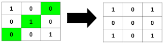
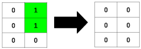
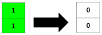

## 3240. Minimum Number of Flips to Make Binary Grid Palindromic II

You are given an ```m x n``` binary matrix ```grid```.

A row or column is considered **palindromic** if its values read the same forward and backward.

You can **flip** any number of cells in ```grid``` from ```0``` to ```1```, or from ```1``` to ```0```.

Return the **minimum** number of cells that need to be flipped to make **all** rows and columns **palindromic**, and the total number of ```1```'s in ```grid``` **divisible** by ```4```.

### Example 1:



```
Input: grid = [[1,0,0],[0,1,0],[0,0,1]]
Output: 3
```
### Example 2:



```
Input: grid = [[0,1],[0,1],[0,0]]
Output: 2
```
### Example 3:



```
Input: grid = [[1],[1]]
Output: 2
```

### Constraints:

* ```m == grid.length```
* ```n == grid[i].length```
* ```1 <= m * n <= 2 * 10^5```
* ```0 <= grid[i][j] <= 1```